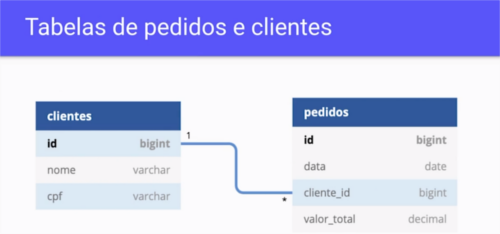
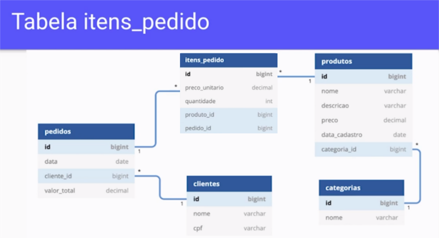
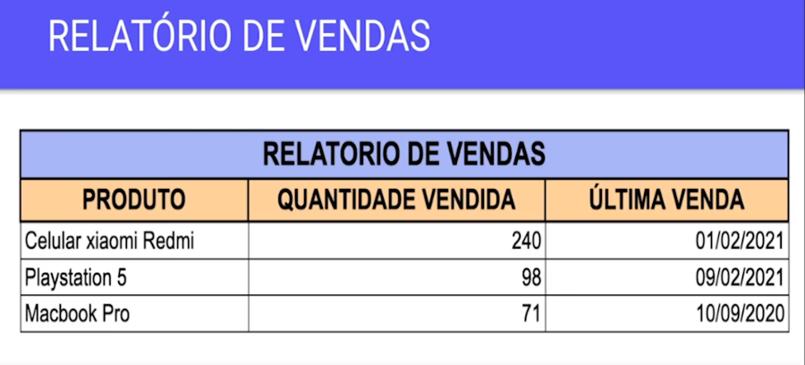
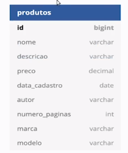
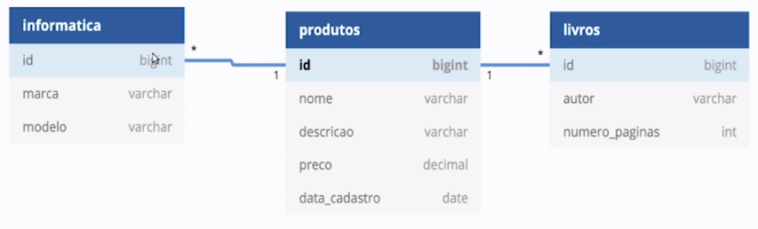

# curso-alura-java-jpa-avancado
<p>
    
    <a href="https://github.com/my-study-area">
        
    </a>
    
    <a href="https://github.com/EliasGcf/readme-template/commits/master">
    
    </a>
</p>
Curso de Java e JPA: Consultas avançadas, performance e modelos complexos

## Módulo 01 - Mais relacionamentos

### Aula 01.01 - Apresentação
Conteúdo:
- Relacionamentos many-to-many e bidirecionais
- Mais consultas (agregação, named queries, select new)
- Lazy, Eager e Join Fetch
- Criteria API
- Outros tópicos (herança, chave composta, etc.)

### Aula 01.02 - Projeto inicial do treinamento
- [Projeto inicial](https://github.com/my-study-area/curso-alura-java-jpa-avancado/tree/aba87e1b9dee18ad40d7d609cc4318bee93add6d)

### Aula 01.03 - Mapeando novas entidades

```java
@Entity
@Table(name = "clientes")
public class Cliente {

	@Id
	@GeneratedValue(strategy = GenerationType.IDENTITY)
	private Long id;
	private String nome;
	private String cpf;

  // getters, setters e construtores
}
```
```java
@Entity
@Table(name = "pedidos")
public class Pedido {

	@Id
	@GeneratedValue(strategy = GenerationType.IDENTITY)
	private Long id;
	private BigDecimal valorTotal;
	private LocalDate data = LocalDate.now();

	@ManyToOne
	private Cliente cliente;

  // getters, setters e construtores

}
```

### Aula 01.04 - Relacionamentos many-to-many

```java
@Entity
@Table(name = "pedidos")
public class Pedido {

	@Id
	@GeneratedValue(strategy = GenerationType.IDENTITY)
	private Long id;
	private BigDecimal valorTotal;
	private LocalDate data = LocalDate.now();

	@ManyToOne
	private Cliente cliente;
	
	@OneToMany
	private List<ItemPedido> itens;

  // getters, setters e construtores

}
```

```java
@Entity
@Table(name = "produtos")
public class Produto {

	@Id
	@GeneratedValue(strategy = GenerationType.IDENTITY)
	private Long id;
	private String nome;
	private String descricao;
	private BigDecimal preco;
	private LocalDate dataCadastro = LocalDate.now();
	
  // getters, setters e construtores

}
```

```java
@Entity
@Table(name = "itens_pedido")
public class ItemPedido {

	@Id
	@GeneratedValue(strategy = GenerationType.IDENTITY)
	private Long id;

	private BigDecimal precoUnitario;

	private int quantidade;

	@ManyToOne
	private Pedido pedido;

	@ManyToOne
	private Produto produto;

  // getters, setters e construtores

}
```

### Aula 01.05 - Relacionamentos bidirecionais
- Ao criar um relacionamento muitos para muitos não podemos esquecer de anotar com `@OneToMany(mappedBy = "pedido")`, no lado  inverso, para impedir a criação de uma tabela desnecessária.

### Aula 01.06 - Parâmetro mappedBy
Por qual motivo o parâmetro mappedBy deve ser utilizado na anotação `@OneToMany`?  
`R:`Para indicar que se trata de um relacionamento bidirecional. Sem esse parâmetro a JPA considera se tratar de outro relacionamento, assumindo que existe outra tabela de join

### Aula 01.07 - Teste do relacionamento bidirecional
- Utilizamos a propriedade `cascade = CascadeType.ALL` num relacionamento para salvarmos em cascata, por exemplo, ao salvar no banco de dados o `Pedido` já é salvo automaticamente o `ItemDoPedido`. Ex:
```java
@OneToMany(mappedBy = "pedido", cascade = CascadeType.ALL)
```

### Aula 01.08 - Parâmetro cascade
Qual a utilidade do parâmetro cascade?  
`R:` Propagar as operações realizadas de uma entidade em seu relacionamento. O cascade cria um efeito cascata nas operações realizadas em uma entidade.

### Aula 01.09 - Faça como eu fiz

### Aula 01.10 - O que aprendemos?
- A mapear novas entidades na aplicação conforme a modelagem do banco de dados;
- A mapear um relacionamento com cardinalidade muitos-para-muitos;
- A mapear um relacionamento bidirecional;
- Como persistir entidades que possuam relacionamentos bidirecionais.

## Módulo 02 - Consultas avançadas

### Aula 02.01 - Projeto da aula anterior

### Aula 02.02 - Consultas com funções de agregação
- Exemplo de consulta utilizando a função `SUM`:
```java
String jpql = "SELECT SUM(p.valorTotal) FROM Pedido p";
BigDecimal total = this.em.createQuery(jpql, BigDecimal.class)
    .getSingleResult();
System.out.println(total);
```

### Aula 02.03 - Consultas para relatórios

- Exemplo de consulta, gerando relatório de pedidos, utilizando um Array de Objetos:
```java
String jpql = "SELECT "
        + "produto.nome, "
        + "SUM(item.quantidade), "
        + "MAX(pedido.data) "
      + "FROM Pedido pedido "
      + "JOIN pedido.itens item "
      + "JOIN item.produto produto "
      + "GROUP BY produto.nome "
      + "ORDER BY item.quantidade DESC";
 Object[] relatorio = this.em
    .createQuery(jpql, Object[].class)
    .getResultList();
```

### Aula 02.04 - Consultas com select new
- Exemplo de consulta, gerando relatório de pedidos, utilizando uma classe para visualização dos dados:
```java
// Exemplo de classe com os dados para visualização
public class RelatorioDeVendasVo {

	private String nomeProduto;
	private Long quantidadeVendida;
	private LocalDate dataUltimaVenda;

	public RelatorioDeVendasVo(String nomeProduto, Long quantidadeVendida,
          LocalDate dataUltimaVenda) {
		this.nomeProduto = nomeProduto;
		this.quantidadeVendida = quantidadeVendida;
		this.dataUltimaVenda = dataUltimaVenda;
	}

  //getters

	@Override
	public String toString() {
		return "RelatorioDeVendasVo [nomeProduto=" + nomeProduto + ", quantidadeVendida=" + quantidadeVendida
				+ ", dataUltimaVenda=" + dataUltimaVenda + "]";
	}
}

//Exemplo de método
public List<RelatorioDeVendasVo> relatorioPedidos() {
  String jpql = "SELECT "
          + "new br.com.alura.loja.vo.RelatorioDeVendasVo("
            + "produto.nome, "
            + "SUM(item.quantidade), "
            + "MAX(pedido.data) "
          + ")"
        + "FROM Pedido pedido "
        + "JOIN pedido.itens item "
        + "JOIN item.produto produto "
        + "GROUP BY produto.nome "
        + "ORDER BY item.quantidade DESC";
  return this.em.createQuery(jpql, RelatorioDeVendasVo.class).getResultList();
}
```
- No JPQL devemos utilizar o caminho completo do pacote com o nome da classe. Ex: `new br.com.alura.loja.vo.RelatorioDeVendasVo(param1, param2)`

### Aula 02.05 - Gerando relatórios
Considere a seguinte consulta JPQL:
```java
select 
    new br.com.alura.loja.dto.VendasPorDia(
        produto.nome,
        sum(pedido.valorTotal),
        pedido.data) 
from Pedido pedido 
join pedido.itens itens join itens.produto produto 
group by produto.nome, pedido.data
```
E a seguinte classe DTO:
```java
public class VendasPorDia {
    private String nomeDoProduto;
    private BigDecimal valorVendido;
    private LocalDate dataDasVendas;

    //getters e setter de todos os atributos
}
```
Por qual motivo a consulta anterior não vai funcionar corretamente?  
`R:` A classe DTO deve conter um construtor compatível com a consulta JPQL. A JPA cria instâncias da classe DTO via construtor que recebe parâmetros, conforme a consulta JPQL.

### Aula 02.06 - Utilizando Named Queries
- `Named Querie` é uma outra forma de realizarmos consultas usando JPQL, mas são criadas nas entidades de domínio da consulta. Por exemplo, na classe Produto:
- Utilizamos a anotação `@NamedQuery`
```java
@Entity
@Table(name = "produtos")
@NamedQuery(name = "Produto.produtosPorNomeDaCategoria", query = "SELECT p FROM Produto p WHERE p.categoria.nome = :nome")
public class Produto {
    // restante do código
}
```
- Para utilizar uma Named Querie devemos utilizar o método `createNamedQuery` conforme exemplo abaixo:
```java
public List<Produto> buscarPorNomeDaCategoria(String nome) {
  return em.createNamedQuery("Produto.produtosPorNomeDaCategoria", Produto.class)
      .setParameter("nome", nome)
      .getResultList();
}
```
- Para identificarmos a origem da named querie é comum nomearmos com o nome da classe, ponto e o nome da querie (`NomeDaClasse.nomeDaQuerie`), como no exemplo acima.

### Aula 02.07 - Vantagens das named queries
Qual das seguintes alternativas é uma das vantagens de se utilizar named queries?  
`R:` Deixar as consultas de uma entidade mais próximas da classe dela. As named queries são declaradas na classe da entidade.

### Aula 02.08 - Faça como eu fiz

### Aula 02.09 - O que aprendemos?
- A realizar consultas utilizando funções de agregação, tais como `MIN`, `MAX`, `AVG` E `SUM`;
- Como escrever consultas de relatórios utilizando `JPQL`;
- Como utilizar o recurso select new em consultas `JPQL`;
- A realizar consultas utilizando named queries.

## Módulo 03 - Performance de consultas

### Aula 03.01 - Projeto da aula anterior

### Aula 03.02 - Entendendo Lazy e Eager
- Relacionamentos `@ManyToOne` e `@OneToOne` carregam os dados de outras entidades mesmo que não estejam sendo utilizados. Este comportamento é chamada de `EAGER` e é o padrão no Hibernate. Veja o log abaixo
```sql
select
    pedido0_.id as id1_3_0_,
    pedido0_.cliente_id as cliente_4_3_0_,
    pedido0_.data as data2_3_0_,
    pedido0_.valor_total as valor_to3_3_0_,
    cliente1_.id as id1_1_1_,
    cliente1_.cpf as cpf2_1_1_,
    cliente1_.nome as nome3_1_1_ 
from
    pedidos pedido0_ 
left outer join
    clientes cliente1_ 
        on pedido0_.cliente_id=cliente1_.id 
where
    pedido0_.id=?
```
- Para tornar um relacionamento `EAGER` em `LAZY` utilizamos a seguinte anotação: `@ManyToOne(fetch = FetchType.LAZY)`

- No relacionamento `@ManyToMany` e `@OneToMany` o carregamento dos dados é `LAZY`, por padrão, ou seja, somente são carregados os dados quando são utilizados.

### Aula 03.03 - Consultas com Join Fetch
 - A exception `org.hibernate.LazyInitializationException` é lançada quando tentamos acessar um dado que pertence a um relacionamento `LAZY` que utilizado após fechar a conexão do EntityManager. Ex:
 ```java
 // Exemplo que lança org.hibernate.LazyInitializationException
public static void main(String[] args) {
    popularBancoDeDados();
    EntityManager em = JPAUtil.getEntityManager();
    
    Pedido pedido = em.find(Pedido.class, 1l);
    System.out.println(pedido.getData());
    em.close();
    System.out.println(pedido.getCliente().getNome());
}
 ```
 - A solução quanto a exception `LazyInitializationException` é a utilização de query planejada, ou seja, na consulta já trazer a Entidade com o seu relacionamento. Ex:
 ```java
public class PedidoDao {

    private EntityManager em;

    // outros métodos

    public Pedido buscarPedidoComCliente(Long id) {
      String jpql = "SELECT p FROM Pedido p JOIN FETCH p.cliente WHERE p.id = :id";
      return this.em.createQuery(jpql, Pedido.class)
          .setParameter("id", id)
          .getSingleResult();
    }
}

//utilização
public static void main(String[] args) {
    popularBancoDeDados();
    EntityManager em = JPAUtil.getEntityManager();
    PedidoDao pedidoDao = new PedidoDao(em);

    Pedido pedido = pedidoDao.buscarPedidoComCliente(1l);
    System.out.println(pedido.getData());
    System.out.println(pedido.getItens().size());
    em.close();
    System.out.println(pedido.getCliente().getNome());
}
 ```

### Aula 03.04 - Consultas com Lazy e Eager
Considere as seguintes entidades JPA:

```java
@Entity
@Table(name = “clientes”)
public class Cliente {

    @Id
    @GeneratedValue(strategy = GenerationType.IDENTITY)
    private Long id;
    private String nome;
    @OneToOne(fetch = FetchType.EAGER)
    private Endereco endereco;
    @OneToMany(fetch = FetchType.LAZY, mappedBy = “cliente”)
    private List<Telefone> telefones = new ArrayList<>();

}
```

```java
@Entity
@Table(name = “enderecos”)
public class Endereco {

    @Id
    @GeneratedValue(strategy = GenerationType.IDENTITY)
    private Long id;
    private String logradouro;
    private String cep;
    private String cidade;
    private String uf;
    private String bairro;
    private String numero;

}
```

```java
@Entity
@Table(name = “telefones”)
public class Telefone {

    @Id
    @GeneratedValue(strategy = GenerationType.IDENTITY)
    private Long id;
    private String ddd;
    private String numero;
    @ManyToOne
    private Cliente cliente;

}
```

E o seguinte trecho de código:
```java
Cliente cliente = em.find(Cliente.class, 1l);
System.out.println(cliente.getNome());
```
Que tipo de consulta no banco de dados o trecho de código anterior vai gerar?  
`R:` Um select na tabela de clientes fazendo join apenas com a tabela de enderecos. O relacionamento com a entidade Endereco é do tipo eager, portanto a consulta vai gerar um join com a tabela de enderecos.

### Aula 03.05 - Vantagens do join fetch
Por qual motivo é interessante utilizar o recurso join fetch em uma consulta JPQL?  
`R:` Para evitar carregar relacionamentos em todas as consultas da aplicação. O join fetch permite escolher quais relacionamentos serão carregados em determinada consulta, ao invés de sempre os carregar

### Aula 03.06 - Faça como eu fiz

### Aula 03.07 - O que aprendemos?
- Como funcionam as estratégias `EAGER` e `LAZY`, em consultas de entidades que possuem relacionamentos;
- Por que a JPA pode lançar a exception `LazyInitializationException` em determinadas situações;
- As boas práticas no carregamento de entidades com relacionamentos;
- Como realizar consultas planejadas com o recurso `join fetch`.

## Módulo 04 - Criteria API

### Aula 04.01 - Projeto da aula anterior

### Aula 04.02 - Consultas com parâmetros dinâmicos
Exemplo de consulta dinâmica usando condicionais:
```java
public List<Produto> buscarPorParametro(String nome, BigDecimal preco, LocalDate dataCadastro) {
  String jpql = "SELECT p FROM Produto p WHERE 1 = 1 ";
  
  if (nome != null && !nome.trim().isEmpty()) {
    jpql += "AND nome = :nome ";
  }
  
  if (preco != null) {
    jpql += "AND preco = :preco ";
  }
  
  if (dataCadastro != null) {
    jpql += "AND dataCadastro = :dataCadastro";
  }
  
  TypedQuery<Produto> query = this.em.createQuery(jpql, Produto.class);
  
  if (nome != null && !nome.trim().isEmpty()) {
    query.setParameter("nome", nome);
  }

  if (preco != null) {
    query.setParameter("preco", preco);
  }
  
  if (dataCadastro != null) {
    query.setParameter("dataCadastro", dataCadastro);
  }
  
  return query.getResultList();
}
```

### Aula 04.03 - Consulta dinâmica
Analise o seguinte método:
```java
public List<Cliente> buscarClientes(String nome, LocalDate dataNascimento) {
    String jpql = "SELECT c FROM Cliente c WHERE ";
    if (nome != null && !nome.trim().isEmpty()) {
        jpql += "AND c.nome = :nome ";
    }
    if (dataNascimento != null) {
        jpql += " AND c.dataNascimento = :dataNascimento ";
    }
    TypedQuery<Cliente> query = em.createQuery(jpql, Cliente.class);
    if (nome != null && !nome.trim().isEmpty()) {
        query.setParameter("nome", nome);
    }
    if (dataNascimento != null) {
        query.setParameter("dataNascimento", dataNascimento);
    }
    return query.getResultList();
}
```
Qual o resultado esperado ao chamar tal método?  
`R:` Uma exception será lançada, independente dos parâmetros informados. A querie contém um erro na cláusula where

### Aula 04.04 - Consultas com Criteria API
- `CriteriaBuilder builder = em.getCriteriaBuilder();`: cria o builder de criteria
- `CriteriaQuery<Produto> query = builder.createQuery(Produto.class);`: cria uma consulta do tipo Produto.
- `Root<Produto> from = query.from(Produto.class);`: seleciona o `FROM` da consulta, onde Produto.class é uma Entidade.
- `Predicate filtros = builder.and();`: cria cláusulas do WHERE para aplicar na consulta.
- `filtros = builder.and(filtros, builder.equal(from.get("nome"), nome));`: adiciona um AND na cláusula WHERE.
- `query.where(filtros);`: adicoina as cláusulas no WHERE.
- `return this.em.createQuery(query).getResultList();`: cria uma consulta utilizando a criteria e retorna uma lista de Produto.
```java
public List<Produto> buscarPorParametrosComCriteria(String nome, BigDecimal preco, LocalDate dataCadastro) {
  
  CriteriaBuilder builder = em.getCriteriaBuilder();
  CriteriaQuery<Produto> query = builder.createQuery(Produto.class);
  Root<Produto> from = query.from(Produto.class);
  
  Predicate filtros = builder.and();
  
  
  if (nome != null && !nome.trim().isEmpty()) {
    filtros = builder.and(filtros, builder.equal(from.get("nome"), nome));
  }
  
  if (preco != null) {
    filtros = builder.and(filtros, builder.equal(from.get("preco"), preco));
  }
  
  if (dataCadastro != null) {
    filtros = builder.and(filtros, builder.equal(from.get("dataCadastro"), dataCadastro));
  }
  
  query.where(filtros);
  return this.em.createQuery(query).getResultList();
  
}
```

### Aula 04.05 - Desvantagens da Criteria API
Qual das seguintes opções é uma das desvantagens da Criteria API?  
`R:` Código mais complexo de entender e manter. A API de Criteria torna o código mais difícil de entender

### Aula 04.06 - Faça como eu fiz

### Aula 04.07 - O que aprendemos?
- Como realizar consultas JPQL com parâmetros opcionais;
- Como funciona a Criteria API da JPA;
- Como realizar uma consulta com parâmetros opcionais via Criteria API.

## Módulo 05 - Outros tópicos

### Aula 05.01 - Projeto da aula anterior

### Aula 05.02 - Simplificando entidades com Embeddable
- `@Embeddable`: diz ao JPA que essa classe é embutível, ou seja, os atributos podem ser embutidos em outra classe.
- `@Embedded`: diz ao JPA que essa propriedade possui dados que deverão ser embutidos na entidade.
Exemplo:
```java
@Embeddable
public class DadosPessoais {

	private String nome;
	private String cpf;

	public DadosPessoais() {
	}

	public DadosPessoais(String nome, String cpf) {
		super();
		this.nome = nome;
		this.cpf = cpf;
	}

	public String getNome() {
		return nome;
	}

	public String getCpf() {
		return cpf;
	}

}
```
```java
@Entity
@Table(name = "clientes")
public class Cliente {

	@Id
	@GeneratedValue(strategy = GenerationType.IDENTITY)
	private Long id;
	
	@Embedded
	private DadosPessoais dadosPessoais;

	public Cliente(String nome, String cpf) {
		this.dadosPessoais = new DadosPessoais(nome, cpf);
	}

}
```

### Aula 05.03 - Mapeamento de herança
Para modelar as classes baseadas em herança temos duas principais opções: `Single Table` e `Joined`
- `Single Table`: todas as propriedade da herança são adicionadas na classe mãe, gerando um tabelão. Exemplo:



```java
@Entity
public class Livro extends Produto {
  //restante do código
}
```
```java
@Entity
public class Informatica extends Produto {
  //restante do código
}
```
```java
@Entity
@Table(name = "produtos")
@Inheritance(strategy = InheritanceType.SINGLE_TABLE)
public class Produto {

}
```
Tabela gerada no banco de dados:
```sql
create table produtos (
    DTYPE varchar(31) not null,
    id bigint generated by default as identity,
    dataCadastro date,
    descricao varchar(255),
    nome varchar(255),
    preco decimal(19,2),
    marca varchar(255),
    modelo varchar(255),
    autor varchar(255),
    numerDePaginas integer,
    categoria_id bigint,
    primary key (id)
)
```
> Obs: ńo SQL é gerada uma coluna chamada DTYPE, que é o nome da classe correspondente na herança, para identificar o produto

- `Joined`: é gerada uma tabela no banco de dados para cada subclasse.

Exemplo de uso nas classes:
```java
@Entity
public class Livro extends Produto {
  //restante do código
}
```
```java
@Entity
public class Informatica extends Produto {
  //restante do código
}
```
```java
@Entity
@Table(name = "produtos")
@Inheritance(strategy = InheritanceType.JOINED)
public class Produto {

}
```
SQL gerado:
```sql
create table Informatica (
    marca varchar(255),
    modelo varchar(255),
    id bigint not null,
    primary key (id)
)

create table Livro (
    autor varchar(255),
    numerDePaginas integer,
    id bigint not null,
    primary key (id)
)

create table produtos (
    id bigint generated by default as identity,
    dataCadastro date,
    descricao varchar(255),
    nome varchar(255),
    preco decimal(19,2),
    categoria_id bigint,
    primary key (id)
)
```
### Aula 05.04 - Herança entre entidades
Analise as seguintes entidades:

```java
@Entity
public class Pessoa {

    @Id
    @GeneratedValue(strategy = GenerationType.IDENTITY)
    private Long id;
    private String nome;
    private String email;

}

```
```java
@Entity
@Inheritance(strategy = InheritanceType.JOINED)
public class PessoaFisica extends Pessoa {

    private String cpf;
    private LocalDate dataNascimento;

}
```
```java
@Entity
@Inheritance(strategy = InheritanceType.JOINED)
public class PessoaJuridica extends Pessoa {

    private String cnpj;
    private String inscricaoEstadual

}
```
Por qual motivo o mapeamento está incorreto?  
`R:` A anotação de herança está na classe errada. A anotação `@Inheritance` deveria ser adicionada apenas na classe base.

### Aula 05.05 - Mapeamento de chaves compostas
- Há casos em que a chave primária de uma entidade é composta, ou seja, composta de duas propriedades. Para isso devemos criar uma nova classe e anotá-la com `@Embeddable` e implementar `Serializable`. Exemplo:
```java
@Embeddable
public class CategoriaId implements Serializable {

	private static final long serialVersionUID = 1L;
	
	private String tipo;
	private String nome;

	public CategoriaId() {
		
	}

	public CategoriaId(String tipo, String nome) {
		this.tipo = tipo;
		this.nome = nome;
	}

	public String getTipo() {
		return tipo;
	}

	public String getNome() {
		return nome;
	}

}
```

- Adicionar a anotação `@EmbeddedId` na propriedade de uma classe que utiliza chave composta. 

```java
@Entity
@Table(name = "categorias")
public class Categoria {
	
	@EmbeddedId
	private CategoriaId id;
	
	public Categoria() {

	}
	public Categoria(String nome) {
		this.id = new CategoriaId("xpto", nome);
	}

	public String getNome() {
		return this.id.getNome();
	}

}
```

### Aula 05.06 - Utilizando chave composta
Considere o seguinte mapeamento:

```java
@Entity
public class Usuario {

    @Embedded
    private UsuarioId id;
}
```

```java
@Embeddable
public class UsuarioId implements Serializable {

    private static final long serialVersionUID = 1L;

    private String nome;
    private String cpf;

}
```
Por qual motivo o mapeamento anterior está incorreto?  
`R:` O atributo id foi mapeado de maneira incorreta. O atributo id deveria ser anotado com `@EmbeddedId` ao invés de `@Embedded`.

### Aula 05.07 - Faça como eu fiz

### Aula 05.08 - Projeto final do curso

### Aula 05.09 - O que aprendemos?
- A utilizar as anotações `@Embeddable` e `@Embedded` para organizar o código de uma entidade;
- A realizar herança entre entidades com as estratégias `SINGLE_TABLE` e `JOINED`;
- Como mapear uma chave composta com a anotação `@EmbeddedId`.
